# PXD017823_Real-Time-Search

Re-analysis of data from PXD017823 exploring real time search for TMT.

## Re-analysis

### Phil Wilmarth, OHSU

### May 27, 2020

---

## Any evidence for a mass measurement problem?

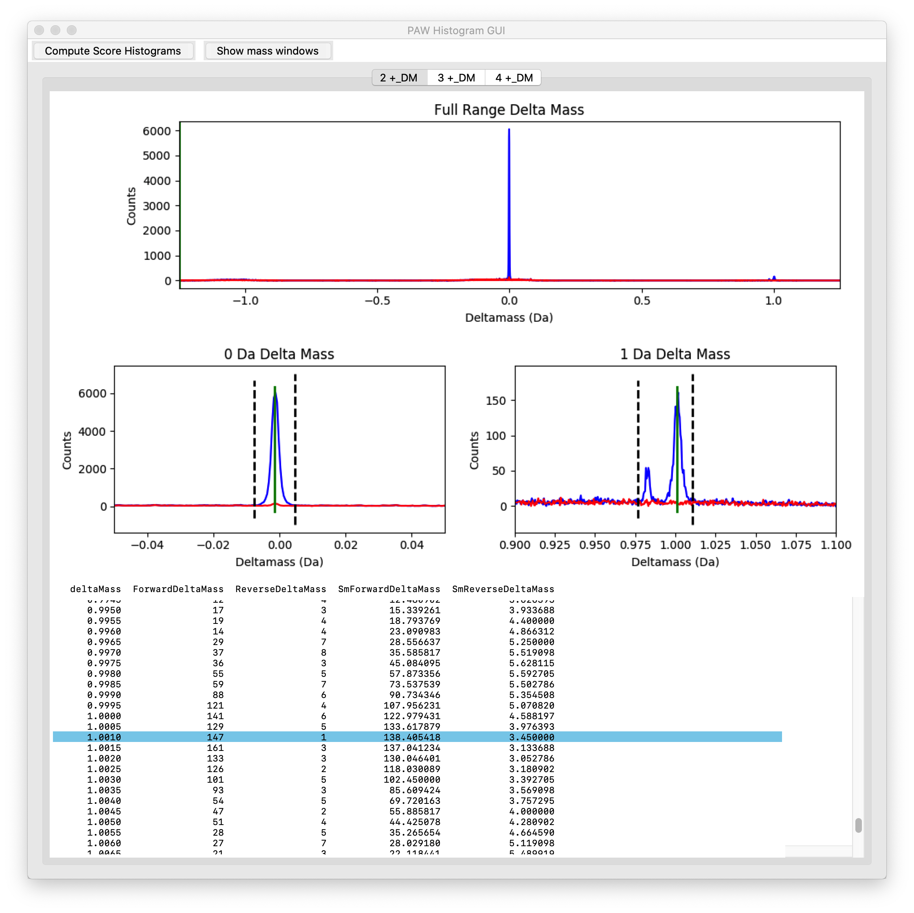

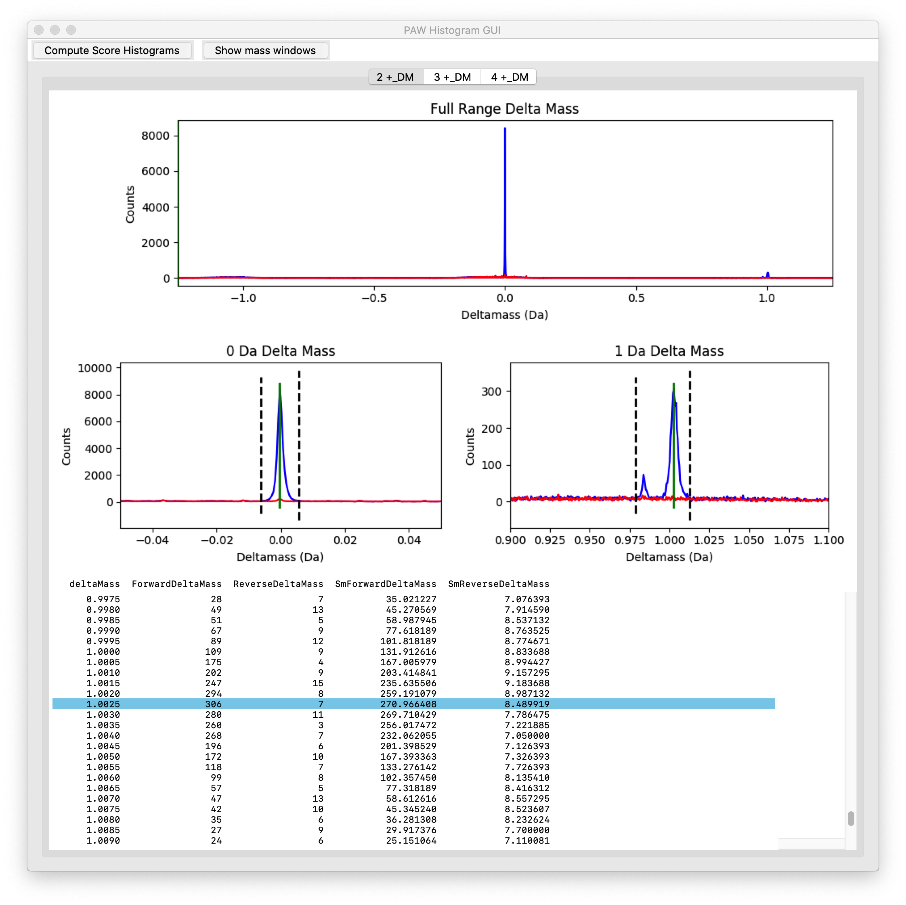

Something about the 2+ masses

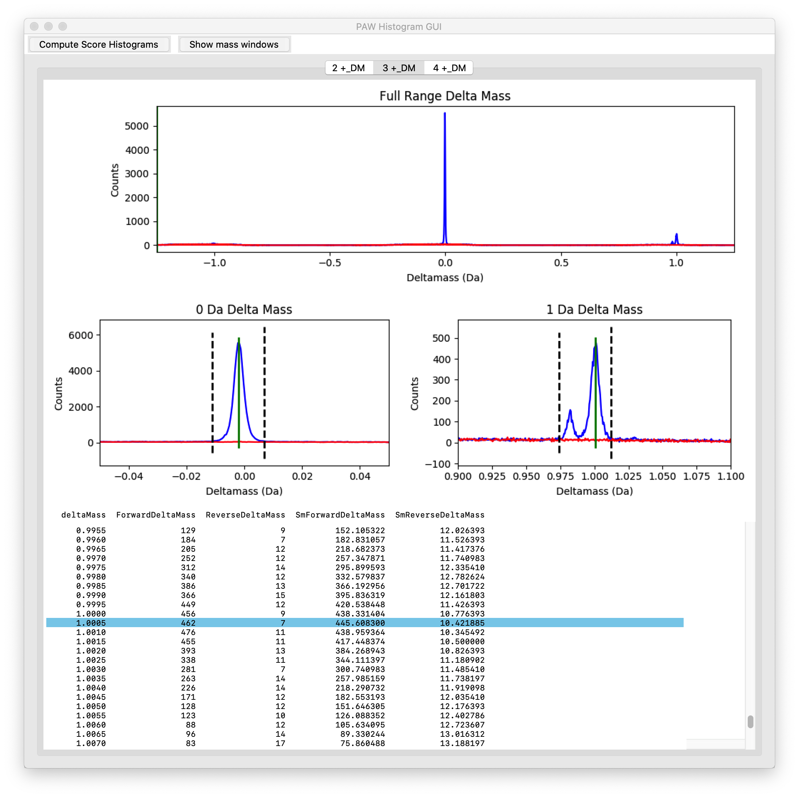

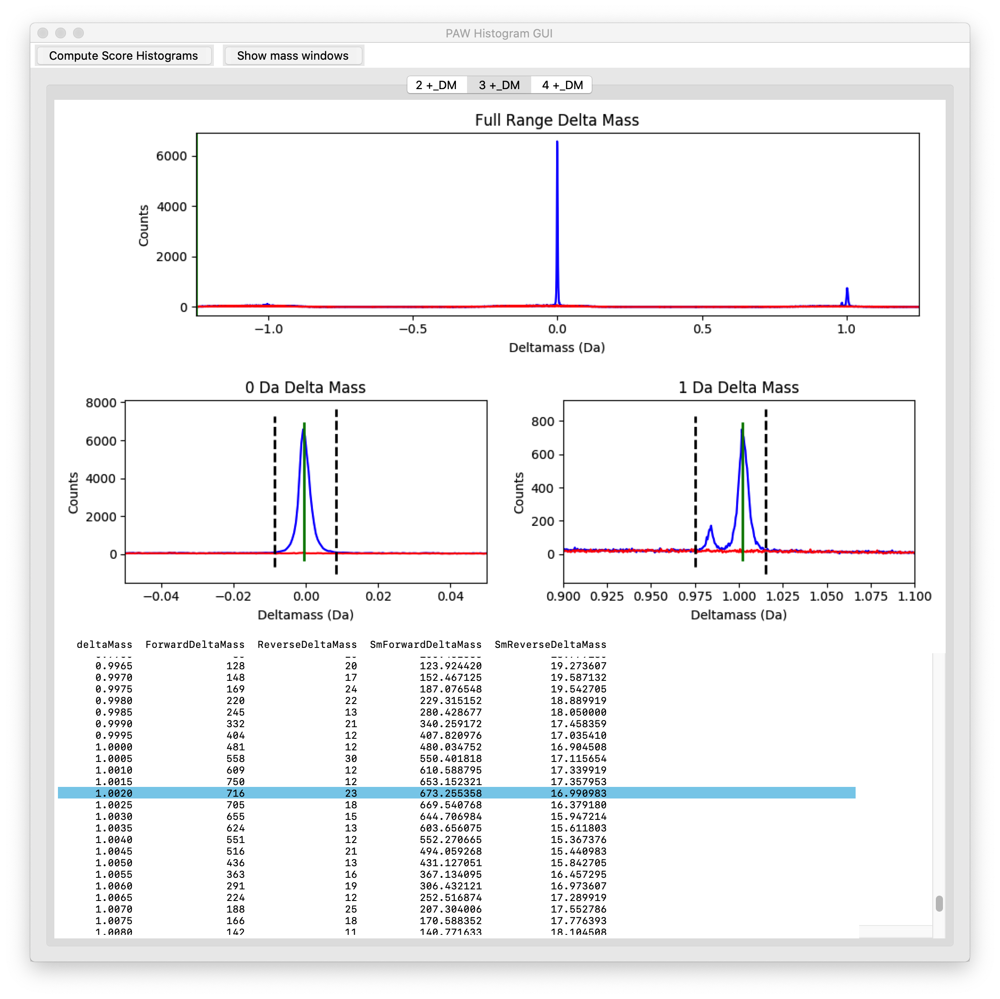

Something about 3+ masses

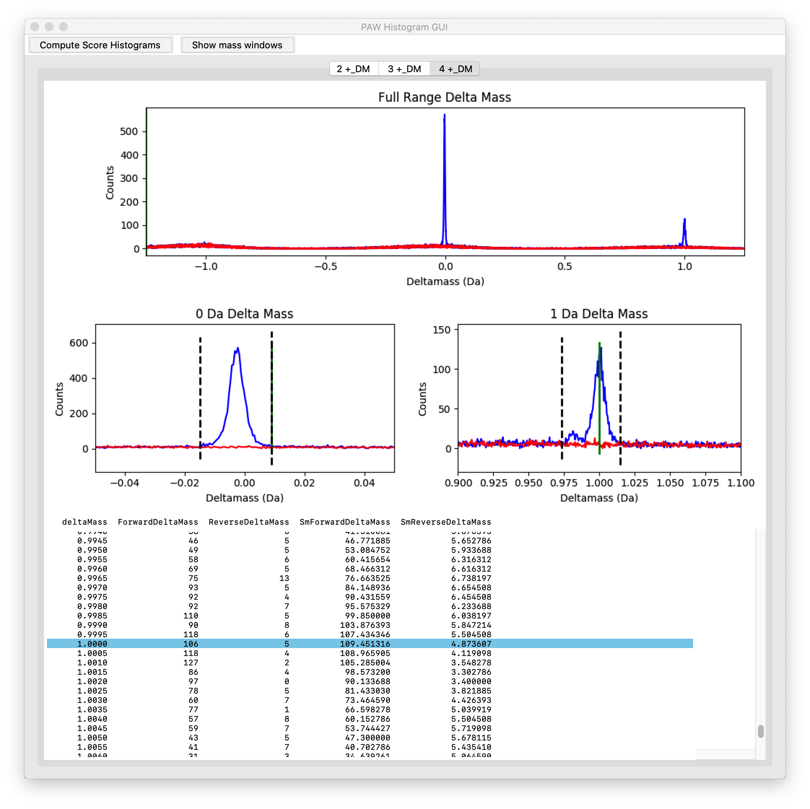

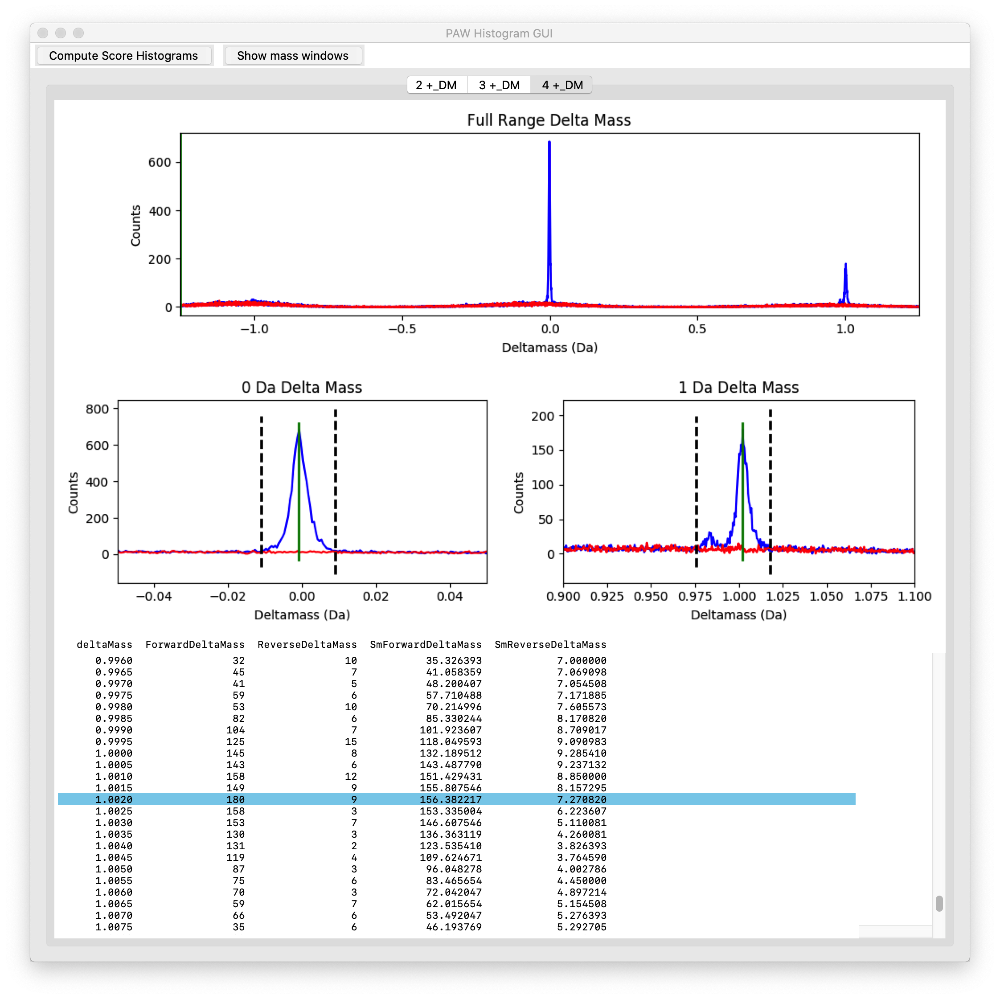

Something about 4+ masses. Overall conclusions.

---

## Dataset Details

Each experiment was 12 fractions.

#### Overall numbers of scans:

Mode|Total MS2 Scans|Total MS3 Scans|MS3 fraction
----|---------------|---------------|------------
Regular SPS MS3|358,870|358,867|100%
RTS w/ close-out|462,711|41,647|9%

#### Filtered scan counts (1% PSM FDR):

Mode|Total|Non-empty MS3|Empty/Missing MS3|Fraction Non-empty
----|-----|-------------|-----------------|------------------
Regular SPS MS3|106,989|106,835|154|99.9%
RTS w/ close-out|116,671|30,604|86,067|26.2%

We can break it down by fractions, too.

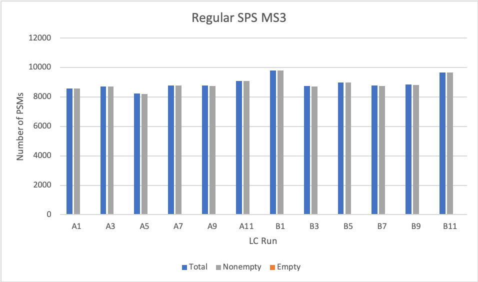

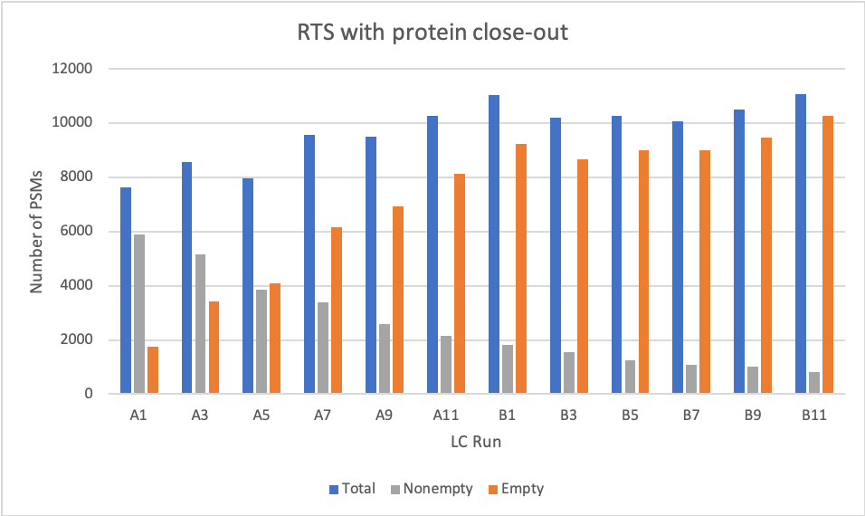

Need a discussion of what RTS and protein close-out are doing.

> some data on the total intensities for each mode.

---

## Individual Proteins

Figure 4F shows some proteins where the acquisition mode resulted in different quantitative measurements. What did my analysis have for those proteins?

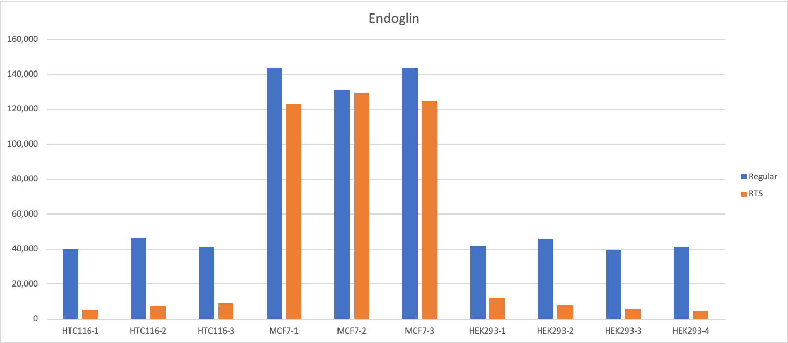

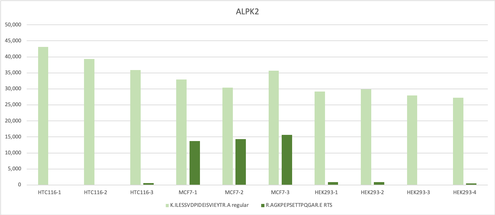

Note that ALPK2 is only identified by a single PSM. My pipeline does not report single peptide protein IDs. I waa able to search through the top hit summaries and find the data. The data does not have any normalizations done for ALPK2. The single peptide from each acquisition mode was not the same, by the way.

Endoglin had 4 and 3 peptides, respectively. We can look at the intensities for the individual peptides, too.

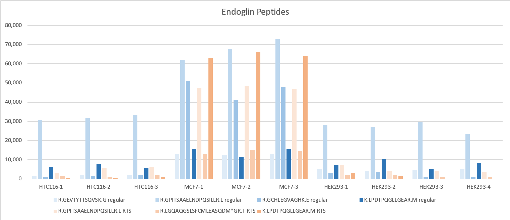

Do these two edge cases have any real bearing on the discussion? Probably not. There can be interference in the m/z regions where reporter ions are (immonium and other low m/z ions). There can also be interference in the isolation window (co-eluting peptides and low-level background when precursor is close to noise levels). There can be biological reasons why specific peptides from specific parts of a protein may have expression levels at odds with more a bulk protein expression estimate. Generally speaking, summing up PSM reporter ions tends to stabilize the peptide and protein values (see the dilution series notebook).

---

## Notebooks are also saved in [HTML format here](https://pwilmart.github.io/PXD017823_Real-Time-Search/)
